# Ryu-based Simple OpenFlow Router 13

This program was created for experimentation and study.

## Usage
You need to write the configuration to `config/config.yaml`
```
$ ryu-manager router.py
```

## Pipeline design
I used [trama book](https://yasuhito.github.io/trema-book/#router13) as a reference.



## Class design
A class is defined for each table, and each table handles the events of its own table_id.


